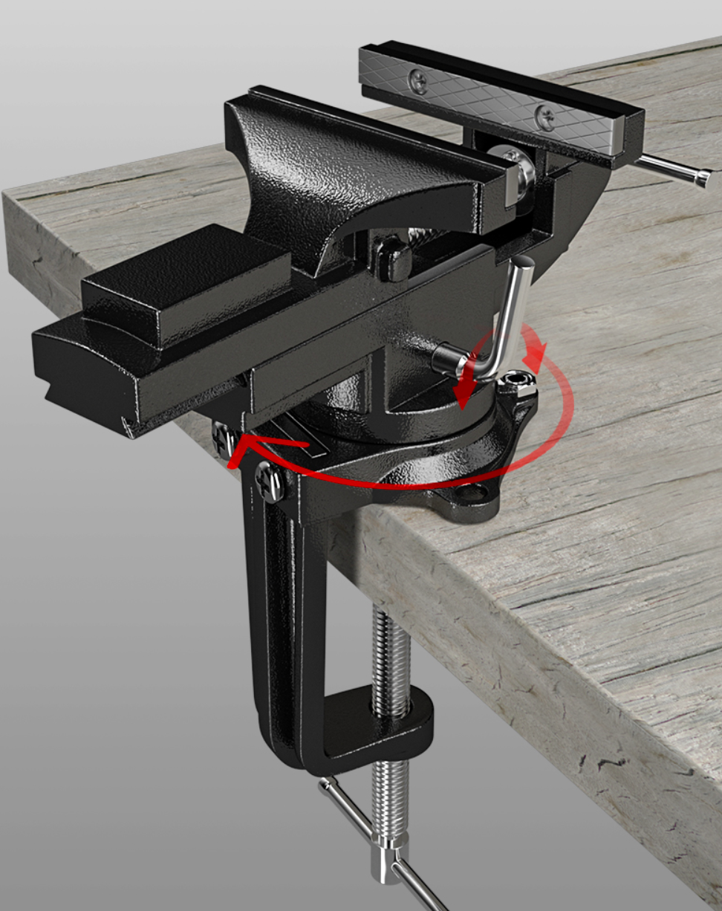

# 木工相关
## 前期 | 造型
### 线锯
拉花锯

### 台虎钳 Table Vice
桌虎钳

用于固定木料、夹持物料，方便木工作业。

<易之力>[国]桌台两用快调80型台虎钳+多功能钳口套装

- 两种固定方式：桌边夹持固定、台面螺栓固定
- 快速调节：增加快速调节按钮，可快速调节钳口间距
- 防滑胶垫：保护脆弱物体表面在加持时不出现痕迹
- 多功能可替换钳口
  - 固定不规则物品：通过不同间距的孔位和竹节螺丝可以固定文玩以及圆形、三角形等不规则物品
  - 磁吸调节：临时快速固定
  - 特殊纹理：V形凹槽、圆弧凹槽，提供更好的夹持点

## 中期 | 打磨 雕刻
### 木工锉
黄金锉

[黄金锉图]

用于快速下料，适合大面积初步打磨。


使用该工具时务必佩戴防护手套。否则使用时极其容易磨破手表皮导致受伤


### 整形锉

[整形锉工具套件图]

用于较为精细的整形、雕刻、打磨。有多种造型可选，适用于不同的整形情景。

//////////// 有待补充：不同场景下适用的整形锉分析

### 电磨机

手持式电动打磨工具。

### 牙机

[牙机造型图]
[手持牙机雕刻作业图]

手持式电动雕刻用具。用于雕刻的头部高速旋转，相较于手工打磨更加高效便携。


不同于电磨机的全一体化，牙机采用的是分体式结构，手持部分更加小巧，更适合笔握式手持，适用于长时间的精细雕刻等场景。


## 后期 | 美化 保养

### 砂纸

用于打磨物体标面，使得物体表面更加光滑。有不同**目数**之分，目数越少代表单位区域内的打磨颗粒越少，砂纸越粗糙；反之代表越光滑。常见的砂纸目数有80、220、400、600、800、1000、2000等。通常将打磨分为粗磨和细磨。

[不同目数的砂纸图片]


砂纸打磨需要从低目**逐层**向高目数打磨，不能跳跃太大。

目数越高，打磨越光滑，但当物体表面光滑到一定程度之后，使用高目数的砂纸便没办法进行“造型上”的修缮。

> 例如，当一个物体表面凹凸不平时，用600目及以下的砂纸打磨可以很快速地将物体表面磨平；而使用1000目或更高目数的砂纸打磨时，物体表面仍旧凹凸不平，只是这些凹凸不平的表面越发光滑而已。此时无论怎么用高目数用力打磨，物体都没有办法变得“平整”，只是变“光滑”而已。

因此物体打磨需要从低依次往高目数打磨。先用低目数修造型，使得物体表面更加平整；再用高目数抛光，使物体表面更加光滑。不能跳跃目数打磨，否则只能从低目数开始从头打磨。



一般而言，600目、800目是**打磨**的最高目数，再高则为**抛光**工序。3000目、5000目为非常高的抛光目数，通常的手工用不到这么高的目数。使用超高目数的砂纸抛光常被戏称为“镜面抛光”。



**水磨**

[沾水打磨的图片]

[水磨砂纸产品图片]

在砂纸或打磨物体的表面沾水再进行打磨，可以将所磨下来的碎屑给吸附在水上，让碎屑不至于飘散于空气之中，维持工作区的整洁，同时也避免人体吸入细微的碎屑。

////////////// 可能还有其他的讲究，笔者不太了解，望补充


<英雄>[国]

<红英>[？]

### 抛光块

分为灰面和白面

### 劳保手套

